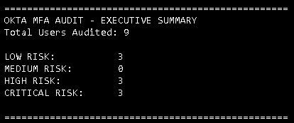
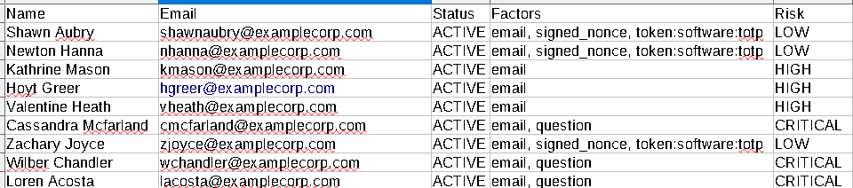

# Okta MFA Audit Tool

## Overview
The Okta MFA Audit Tool is a Python-based IAM automation project that leverages the Okta REST API to assess MFA enrollment across an Okta tenant.

It retrieves user accounts, analyzes enrolled authentication factors, classifies authentication risk, and generates both a detailed CSV report and an executive summary.

---

## Features
- Retrieve users from Okta via REST API
- Enumerate enrolled MFA factors
- Classify authentication risk levels
- Generate executive summary statistics
- Export audit findings to CSV
- Secure credential management using environment variables

---

## Technologies Used
- Python
- Okta REST API
- Requests
- Pandas
- python-dotenv

---

## Output Example

### Executive Summary
Shows risk distribution across all users.

### CSV Report
Exports user MFA inventory and risk classification.

---

## Security Notes
- API tokens are stored using environment variables
- `.env` file is excluded from Git via `.gitignore`